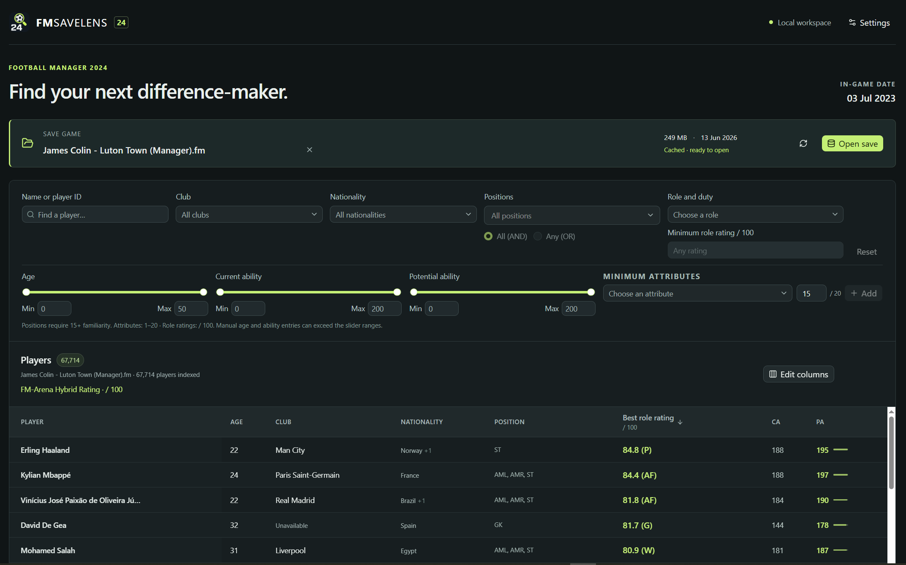
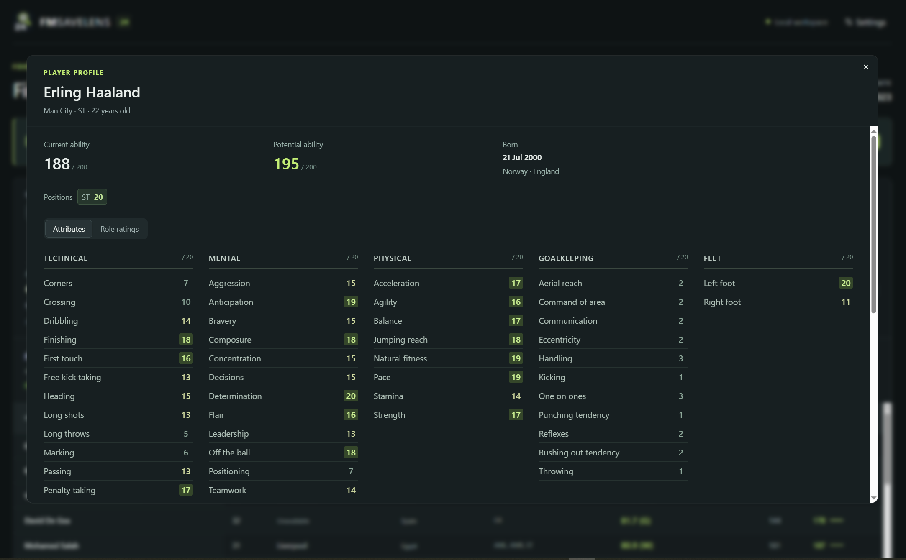
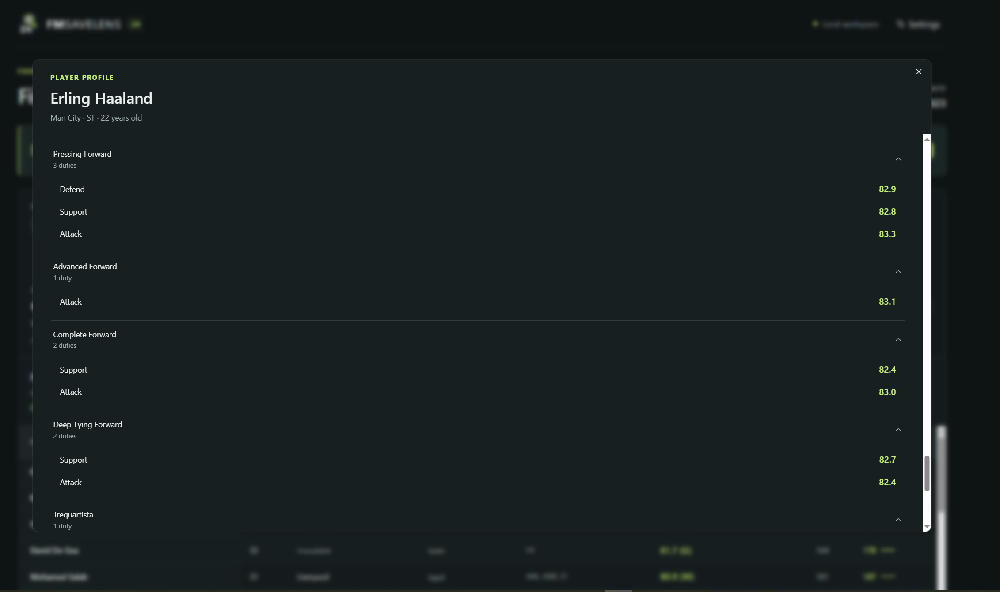

# FM SaveLens 24

A local, read-only Football Manager 2024 save reader for desktop and browser. Search and filter players, compare CA/PA and attributes, and rate players by role. Your data stays on your computer.

Supports FM24 internal save format **24.3.0+0**, compressed or uncompressed. Not affiliated with Sports Interactive or SEGA.

## Showcase

Desktop screenshots using **James Colin - Luton Town (Manager)**, with 67,714 players indexed on the in-game date of 3 July 2023.

### Player search and filters

Explore your save with filters for club, nationality, position, age, ability, attributes, and role rating.



### Player attributes

Inspect current and potential ability, position familiarity, and detailed attributes in each player's profile.



### Role ratings

Compare a player's ratings across roles and duties to find a fit for your tactics.



## How to run

Download a build from [GitHub Releases](https://github.com/MSalman5230/FM-SaveLens-24/releases). Packaged builds need neither Node.js nor Rust.

### Windows 10/11 (x64)

- **Portable ZIP:** Extract everything to a local folder and run `fm-savelens-24.exe`. Keep the bundled `WebView2Runtime` folder beside it.
- **Installer:** Run the Windows setup `.exe` and follow the prompts.
- **Browser mode:** In the portable folder, run `Start-Browser.cmd`; use `Stop-Browser.cmd` to stop it.

### Linux (x86_64)

Download the AppImage, then run these commands from its folder:

```sh
chmod +x FM-SaveLens-24-*.AppImage
./FM-SaveLens-24-*.AppImage
```

Append `--browser` for browser mode or `--appimage-extract-and-run` if FUSE is unavailable. The AppImage requires a graphical system with glibc 2.35 or newer (Ubuntu 22.04 or equivalent).

Alternatively, download the Flatpak bundle and install it:

```sh
flatpak remote-add --user --if-not-exists flathub https://dl.flathub.org/repo/flathub.flatpakrepo
flatpak install --user ./FM-SaveLens-24-*.flatpak
flatpak run io.github.MSalman5230.FMSaveLens24
```

### macOS (Apple Silicon or Intel)

- **Apple Silicon (M-series):** Download `FM-SaveLens-24-v<version>-macos-arm64.dmg`.
- **Intel:** Download `FM-SaveLens-24-v<version>-macos-x86_64.dmg`.

Open the DMG, drag **FM SaveLens 24** into **Applications**, then launch it from there. You can find your Mac's chip or processor under **Apple menu > About This Mac**.

The macOS builds are ad-hoc signed and are not notarized by Apple. If macOS blocks the first launch, open **System Settings > Privacy & Security**, choose **Open Anyway** for FM SaveLens 24, and confirm. Only allow a download you trust from this project's releases.

For browser mode, first quit the desktop app with **Cmd+Q**, then run this command in **Terminal**:

```sh
"/Applications/FM SaveLens 24.app/Contents/MacOS/fm-savelens-24" --browser
```

Keep Terminal open while using browser mode. Before reopening the desktop app, press **Ctrl+C** in Terminal to stop browser mode and release the shared data directory.

After launching on any platform, finish saving in Football Manager, set your save folder in **Settings**, choose a save, and click **Read save**.

### Update notifications

Open **About** to check for updates, see the last successful check, or turn off **Automatically check for updates**. Automatic checks run once a day while the app is open and contact GitHub without sending save data. Offline checks never interrupt your work.

A banner announces newer stable releases once all downloads are ready. **Dismiss** hides that version's banner across restarts; its **View release** button remains available in About. A later version shows a new banner. **View release** opens GitHub in your system browser so you can download and install the appropriate package yourself. Update preferences survive clearing save caches.

Existing installations need a manual upgrade to the first release containing update notifications before they can notify you about later releases.

## Contributing

Open an issue for bugs or ideas, or fork the repository and submit a pull request. Keep changes focused, use Conventional Commits (`fix:`, `feat:`), and never commit private save files.

Use a Conventional Commit PR title, such as `fix: preserve fractional snapshot timestamps` or `feat(ui): add app branding`. The **PR title** check fails invalid titles with format guidance; edit the title manually to correct it. **Squash and merge using the validated title as the commit subject** so Release Please can detect the change. See [PR title rules and setup](docs/PR_TITLES.md).

To develop on Windows, Linux, or macOS, install Node.js **24.14+**, Rust via rustup (the toolchain is pinned in `rust-toolchain.toml`), and the [Tauri build prerequisites](https://v2.tauri.app/start/prerequisites/). Then:

```sh
git clone https://github.com/MSalman5230/FM-SaveLens-24.git
cd FM-SaveLens-24
npm ci
npm --prefix web ci
npm run build:web
npm start
```

Open [localhost:4242](http://localhost:4242). For frontend hot reload, also run `npm --prefix web run dev` and open [localhost:5173](http://localhost:5173). For the desktop app, run `npm run tauri -- dev`.

Before submitting a pull request, run:

```sh
npm test
npm run test:web
node --test tests/pr-title.test.mjs
npm --prefix web run lint
cargo fmt --all -- --check
cargo clippy --locked --workspace --all-targets -- -D warnings
```

See [format notes](docs/FORMAT.md) and [validation results](docs/VALIDATION.md) for parser details.
